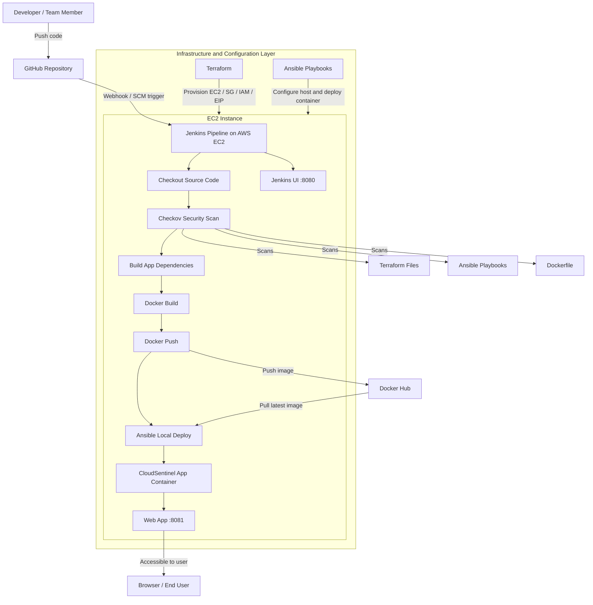

# CloudSentinel Architecture Diagram

## Mermaid Diagram

## Diagram Notes

- GitHub stores the application source code, Jenkins pipeline, Terraform files, and Ansible playbooks.
- Jenkins acts as the CI/CD controller and runs on the EC2 instance.
- Checkov scans the infrastructure and deployment definitions before build and deployment continue.
- Docker packages the Node.js application and pushes the image to Docker Hub.
- Ansible performs the deployment on the same EC2 host using a local connection.
- Jenkins is available on port `8080`, while the deployed application is available on port `8081`.

## Suggested Figure Caption

**Figure X.** Architecture of the CloudSentinel DevSecOps pipeline showing GitHub integration, Jenkins orchestration, Terraform-based provisioning, Ansible-based deployment, Docker image flow, and the final application hosted on AWS EC2.
